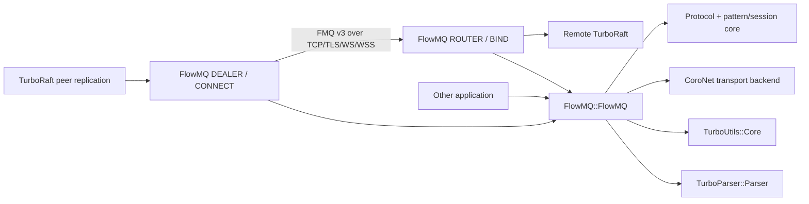
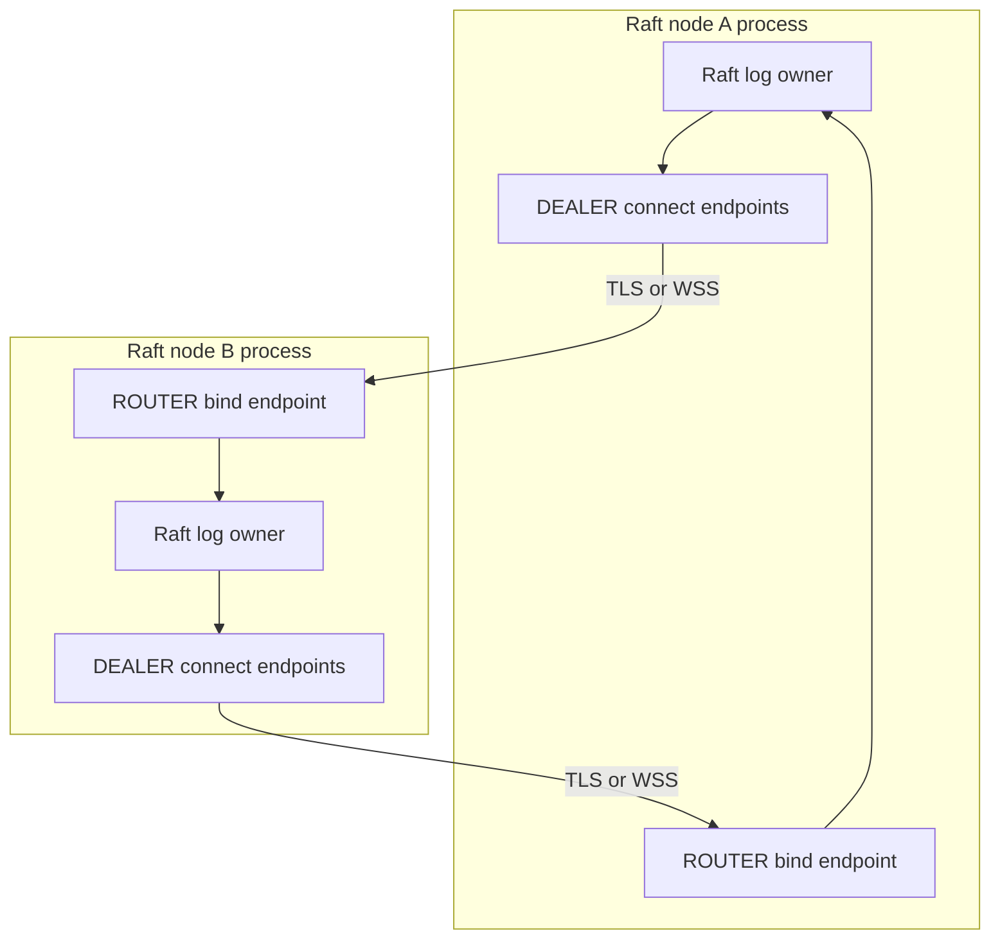

# FlowMQ

FlowMQ 是独立的 C 消息模式库。默认构建不依赖 TurboFlow、Graph、YAML、数据库或 HTTP；复杂业务
拓扑由上层适配器组合，FlowMQ 本身拥有 wire、pattern/session 状态和 CoroNet endpoint 生命周期。

## Targets

| Target | 说明 |
| --- | --- |
| `FlowMQ::Protocol` | build-tree static target；FMQ v3 codec，不安装 |
| `FlowMQ::Core` | build-tree static target；pattern/session 状态，不安装 |
| `FlowMQ::Transport` | build-tree static target；graph-neutral endpoint，当前由 CoroNet 实现，不安装 |
| `FlowMQ::FlowMQ` | 唯一安装 target；统一输出 `flowmq.dll` |

```cmake
find_package(FlowMQ CONFIG REQUIRED)
target_link_libraries(my_app PRIVATE FlowMQ::FlowMQ)
```

```c
#include "flowmq.h"

int compatible =
    flowmq_core_patterns_compatible(FLOWMQ_PROTOCOL_REQ, FLOWMQ_PROTOCOL_REP);
```

独立 endpoint 使用类型化配置，不需要 Graph 或配置文件：

```c
flowmq_connect_endpoint_config_t config;
flowmq_connect_endpoint_t *endpoint = NULL;

flowmq_connect_endpoint_config_init(&config);
config.pattern = FLOWMQ_PROTOCOL_SUB;
config.host = "127.0.0.1";
config.port = 7001;
config.path = "";
config.topic = "orders.";
config.identity = "order-reader";
config.drive_context = 1;
config.own_context = 1;

if (flowmq_connect_endpoint_create(&config, &endpoint) == TURBO_OK) {
  flowmq_connect_endpoint_destroy(endpoint);
}
```

ROUTER 使用独立 BIND owner；DEALER 仍使用同一个 CONNECT owner：

```c
flowmq_router_endpoint_config_t router_config;
flowmq_router_endpoint_t *router = NULL;

flowmq_router_endpoint_config_init(&router_config);
router_config.host = "0.0.0.0";
router_config.port = 7001;
router_config.path = "";
router_config.topic = "raft";
router_config.identity = "raft-node-a";
router_config.max_connections = 32;
router_config.drive_context = 1;
router_config.own_context = 1;

if (flowmq_router_endpoint_create(&router_config, &router) == TURBO_OK) {
  /* flowmq_router_endpoint_start(router, timeout_ns); */
  flowmq_router_endpoint_destroy(router);
}
```

`ROUTER` callback 收到的 `flowmq_router_route_t` 不含 peer 指针，可以复制后延迟使用；peer 断线或
endpoint restart 后，旧 token 返回 `TURBO_ENOTCONN`。低层 `send()` 仍须在 endpoint 的 CoroNet
context 上执行；普通业务线程使用 `flowmq_connect_endpoint_send_copy()` 或
`flowmq_router_endpoint_send_copy()`。copied admission 同时受 item/byte 两个硬上限约束，满额返回
`TURBO_ENOSPC`，成功后每条消息恰好调用一次 local send completion。该 completion 不是远端 durable
receipt。

`FlowMQ::FlowMQ` 同时安装 `flowmq_media_provider_v1.h` 和 canonical
`share/flowmq/schema/flowmq_media_provider_v1.schema`。Iris 与 TurboMedia 必须使用这些生成类型交换
`ProviderCommandV1`、durable receipt/completion、event/ack、query/observation 和 call bootstrap；不能
在两侧分别手写 JSON struct。超过 JSON 精确整数范围的 fence/revision/sequence 使用 decimal string。
每个 binary payload 的前 5 字节固定为 `schema_version:uint32 + message_kind:uint8`；消费者先调用
`flowmq_media_provider_peek_kind()` 路由，再调用对应 generated decoder。schema 内所有固定宽度字段位于
可变字符串之前，保证 generated binary codec 有确定 wire location；未知 version/kind 明确拒绝。
`ProviderCompletionV1` 必须由 `ProviderCompletionAckV1` 结束 durable delivery；只有 Iris 已原子提交
command terminal state/result event 后才能返回 `CompletionCommitted` 与该 result event 的
session-local `committed_sequence`，FlowMQ send completion 不能替代该 ack。`ProviderEventAckV1` 使用相同
的 sequence 语义。completion 自带稳定 `event_id`，不得用 transport `message_id` 代替业务事件幂等键。

ROUTER 可配置 `verify_peer_identity`，在 DEALER HELLO 进入 route registry 前，将 CoroNet 验证过的客户端
证书 SHA-256 与 claimed identity 交给宿主绑定。配置该回调时必须同时配置强制 mTLS，否则 endpoint
create fail fast；不能仅凭客户端自报 identity 路由 provider command。

## Architecture and deployment





选择 `FLOWMQ_TRANSPORT_WSS` 即自动走 WSS listener/connect；不会在运行时从明文 WS 静默升级。
TLS/WSS 的 ROUTER 必须显式提供 server certificate/key；mTLS 还必须提供 CA。每个节点通常暴露一个
ROUTER listener，并为每个远端 peer 持有一个稳定 identity 的 DEALER connection。

## Build and test

```text
cmake --preset win-dev-user
cmake --build --preset win-dev-user --target flowmq_transport flowmq_core flowmq_protocol
ctest --preset win-dev-user -L flowmq --output-on-failure
```

安装包只导出 `FlowMQ::FlowMQ`、`flowmq.dll`、必需的 import library 和公开头文件；三个组件静态库
只服务于仓库内测试与分层开发，不进入默认 Release build 或安装包。Windows preset 默认安装到
`C:/projects/cpp/external/pkgs/flowmq`。其 CMake package 会自动查找并公开传递
`TurboUtils::Core`、`TurboParser::Parser` 与 `TurboParser::DataBind`；消费者无需重复写入链接行。

## Ownership boundary

- `flowmq_protocol_frame_t` 的单 packet payload、identity 与 topic 是输入 buffer 的 borrowed view；
  multi-packet payload 由 frame 拥有并通过 `flowmq_protocol_frame_cleanup()` 释放。
- `flowmq_connect_endpoint_t` 独占 socket；配置字符串在 create 时复制，callback context 保持 borrowed。
  frame view 只在回调期间有效。`stop()` 先停止 admission，再 interrupt 等待、等待 managed coroutine
  退出，最后才允许 destroy socket/context。
- `flowmq_router_endpoint_t` 独占 listener 与 peer registry。`max_connections` 同时预留逻辑 route
  容量并设置 CoroNet pre-handshake admission limit；满额连接在进入 FlowMQ handler 前关闭。
  shutdown 先关闭 admission，再取消 accepted tasks，等待 `coro_socket_server_is_stopped()`，最后销毁
  listener/context。
- 外部 `coro_context_t` 默认 borrowed；只有 `own_context != 0` 才转移销毁责任。`send()` 必须运行
  在 endpoint context 上，输入只借用到调用返回。
- copied send admission 是 MPSC→单 endpoint-context consumer。成功时 endpoint 拥有 frame 副本；失败
  时不接收所有权且不调用 completion。`stop()` 原子关闭 admission、排空已接受 callback，再停止
  socket/context；队列 current/high-water、满额拒绝和 completion/failure 可读取。
- 当前仓库中保留的 `turbo_flow_fmq*`、security owner、management 和 deployment 文件只是历史迁移
  参考，不属于任何默认 target，也不进入安装包。旧 `add_subdirectory(flowmq)` 会明确失败；外部适配器
  只能消费已安装的 `FlowMQ::FlowMQ`。

架构决策见 [ADR_LIBRARY_BOUNDARY.md](ADR_LIBRARY_BOUNDARY.md)。
