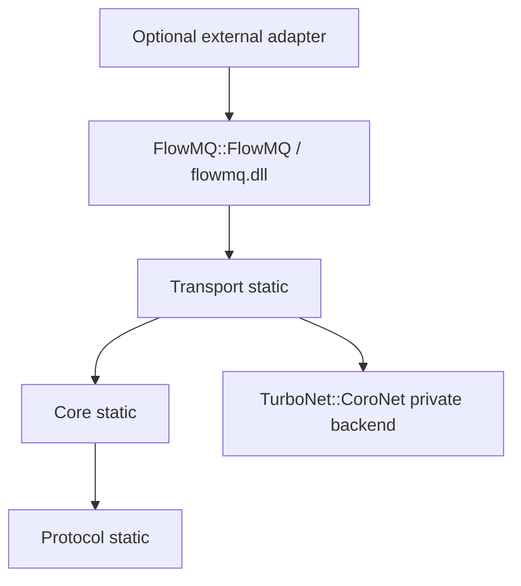

# ADR: FlowMQ 独立库边界

## 状态

已采纳。独立发布面保持 FMQ wire v3 和现有 Core 状态语义，并已加入 graph-neutral CoroNet
CONNECT endpoint 与 ROUTER/BIND endpoint；未迁移或重写协议数据。

## 背景

新仓库最初复制了 TurboFlow 顶层工程，根 CMake 仍构建 Graph、旧持久化、Flowie、Gateway 等不存在
目录；FlowMQ endpoint security 又直接包含 `turbo_flow_fmq.h`。这使新工程既不能独立 configure，
也无法证明基础消息模式不依赖 Graph。

## 候选方案

1. 在新仓库继续 `find_package(TurboFlow)`。迁移最快，但保留反向依赖，否决。
2. 一次性重写 endpoint、security、management 和 Graph adapter。公开 API、生命周期和安全风险过大，
   否决。
3. 先发布 Protocol/Core，冻结未解耦 adapter 源码，随后按公开 FlowMQ API 增量迁移 transport，采纳。

## 决策

- `FlowMQ::Protocol` 是 wire 事实源，仅作为 build-tree static target。
- `FlowMQ::Core` 是 pattern/session、subscription、reconnect 与 decoder 状态事实源，仅作为
  build-tree static target。
- 默认 target 不编译 `turbo_flow_fmq*`、Graph adapter、TurboFlow security provider 或旧产品控制面。
- Core 共享库只导出已声明的 public API；私有状态机测试使用单独静态 test subject，不扩大 ABI。
- `FlowMQ::Transport` 是 build-tree static target，提供类型化 transport/options、opaque CONNECT
  endpoint 与 ROUTER/BIND endpoint；不暴露 Graph 类型。CoroNet 是当前私有实现依赖，不作为
  FlowMQ 产品 target 名称的一部分。
- `FlowMQ::FlowMQ` 是唯一安装 target 和稳定消费者入口；Protocol、Core、Transport 的公开实现统一
  编入 `flowmq.dll`；BIND/server owner 不改变调用方链接行。

## 所有权、错误与关闭

Protocol view 的失效点由 `flowmq_protocol.h` 定义；调用方不得跨输入 buffer 生命周期保存 borrowed
字段。Core 不创建隐藏队列、不静默丢弃。CONNECT endpoint 独占 socket；ROUTER endpoint 独占
listener 和 peer registry。ROUTER 关闭时先关闭 admission、取消 accepted tasks、等待 CoroNet server
quiescence，再销毁 listener 和明确拥有的 context。
非法 pattern、损坏 frame、状态不匹配和容量错误继续返回明确 Turbo error，不引入 fallback。

## 兼容性与迁移

- wire：FMQ v3 不变。
- source：已公开的 `flowmq_protocol.h` 与 `flowmq_core.h` 保持可用。
- build：`FlowMQ::Protocol/Core/Transport` 只生成 build-tree static library；安装只导出
  `FlowMQ::FlowMQ`。
- 未迁移的 TurboFlow facade 不进入安装；它保留在源码树中以避免无 Git 仓库下的不可恢复删除。

下一阶段可在不改变 wire 的前提下定义独立安全 provider SPI；TurboFlow 仓库只保留可选 Graph adapter。
任何阶段都可回滚到上一个已安装 FlowMQ 包，不需要转换 wire 数据。

## 验证

必须通过 Protocol/Core/Transport endpoint TinyTest、共享库消费者示例、CMake install，以及安装后独立
`find_package(FlowMQ CONFIG REQUIRED)` consumer configure/build/run。
