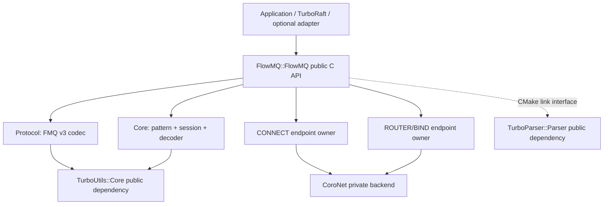
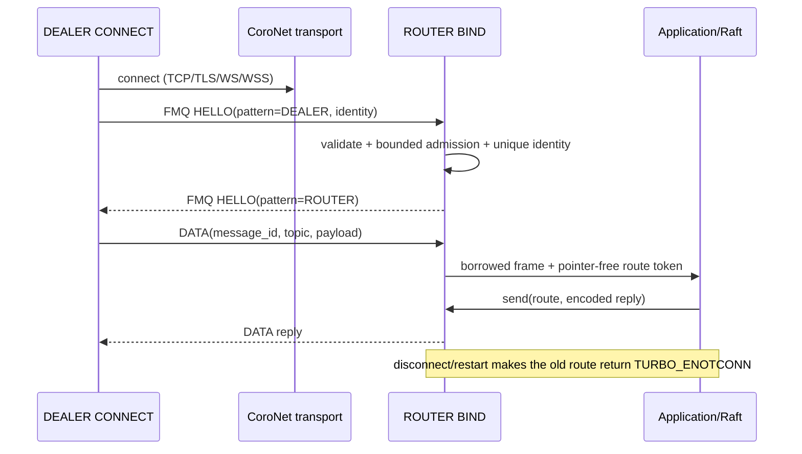
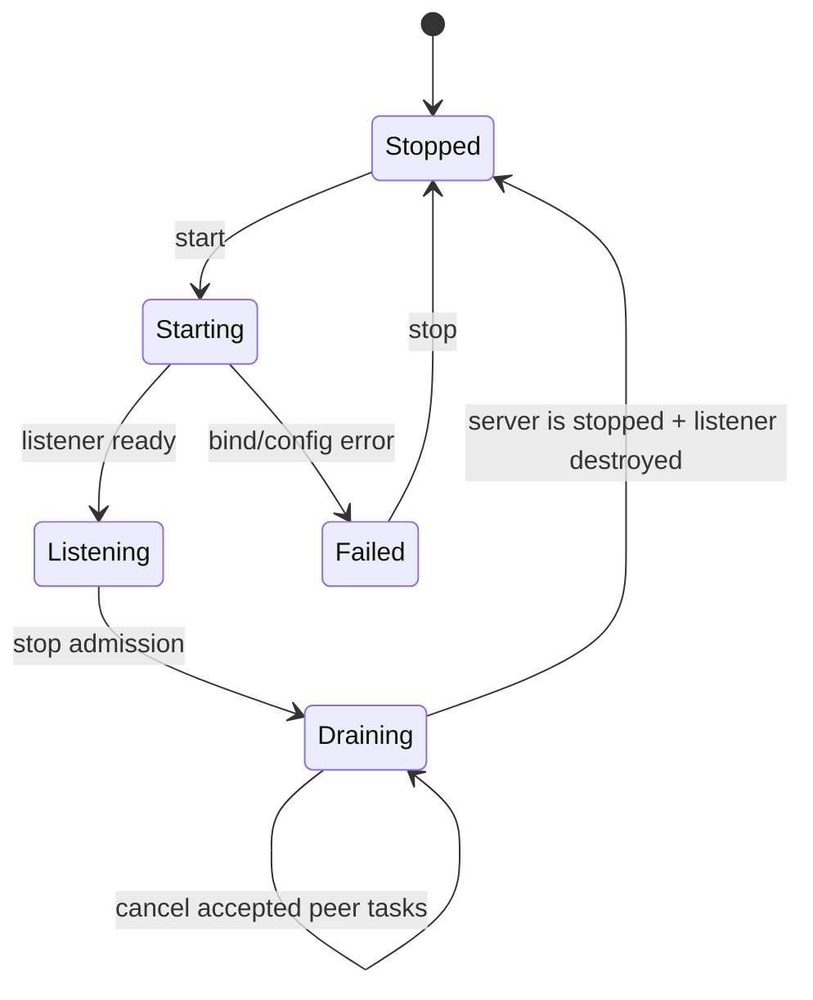
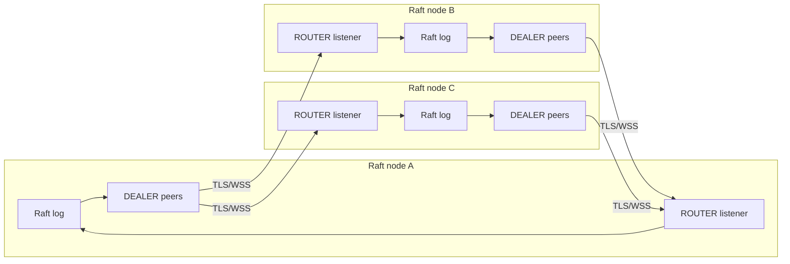

# FlowMQ architecture

FlowMQ 是独立的 pattern-oriented messaging library。它负责 wire、pattern/session 状态和 CoroNet
endpoint 生命周期；Raft、TurboFlow 或其他宿主只通过公开 callback/send API 组合业务语义，不反向
拥有 socket 或复制 peer 状态。

## Layers

| Layer | State owner | Installed form |
| --- | --- | --- |
| Protocol | encoded/decoded frame ownership contract | compiled into `FlowMQ::FlowMQ` |
| Core | compatibility、peer exchange FSM、bounded decoder | compiled into `FlowMQ::FlowMQ` |
| CONNECT | one outgoing socket、HELLO、reconnect、heartbeat | public opaque owner |
| ROUTER/BIND | listener、admitted peers、identity registry、route generation | public opaque owner |
| CoroNet | transport socket/task/close completion | private implementation dependency |

`FlowMQ::Protocol`、`FlowMQ::Core`、`FlowMQ::Transport` 只是仓库内 static test/development targets；
安装包只导出 `FlowMQ::FlowMQ`。该目标公开传递 `TurboUtils::Core` 与 `TurboParser::Parser`；CoroNet
和 TLS backend 仍是私有实现依赖。

## Media-provider application contract

`flowmq_media_provider_v1.schema` 的所有消息共享固定 binary prefix：offset 0 的 little-endian
`schema_version:uint32` 与 offset 4 的 `message_kind:uint8`。接收方必须先用
`flowmq_media_provider_peek_kind()` 判别消息，再进入 typed decoder。所有其他 fixed-width field 也必须排在
variable data 之前；改变该布局属于 breaking wire change。

Command 的 local send completion、durable receipt、terminal completion 和 completion ack 是四个不同状态。
ROUTER 只在可选 `verify_peer_identity` 成功后注册 route；启用该验证却未强制 mTLS 属于非法配置。

## ROUTER/DEALER data path

Input unit 是完整 FMQ v3 frame。CoroNet recv chunk 由 CoroNet 拥有，append 后立即释放；decoder
buffer 由 peer session 拥有并按 `max_frame_size` 设置硬上限。单 packet frame 的字段借用 decoder
buffer且只活到 callback 返回；fragmented payload 由 decoded frame 临时拥有并在 dispatch 后清理。

`flowmq_router_route_t` 只有 `endpoint_id + generation + session_id`，不保存 socket/peer pointer。
registry 只在 endpoint context 上修改；发送也必须在该 context 上执行。异步业务可以复制 token 和
owned payload，通过 endpoint 的 copied send admission 回到 owner context；不能保存 callback 中的裸
view。copied admission 是 MPSC→单 context consumer，item 与 retained encoded bytes 双有界；成功
admission 转移副本所有权，失败仍由 caller 拥有原始输入。

## Capacity, backpressure, and shutdown

- `max_connections` 是硬上限。create 时预留 route registry，listen 前设置 CoroNet admission limit；
  限额包含 raw accept、TLS/WSS handshake、handler 和 close completion，避免握手阶段绕过容量约束。
- 每个 peer decoder 受 `max_frame_size` 限制；CoroNet send queue 受 `send_hwm_bytes` 限制。满额或
  过大输入返回明确错误，不转为隐藏无界队列。
- copied send 满额返回 `TURBO_ENOSPC`；成功 admission 的每一项最终恰好产生一次 local send
  completion。该 completion 不表示远端应用持久化，业务协议仍须提供 receipt/ack。
- ROUTER peer identity 在同一 listener generation 内唯一，重复 identity 拒绝为 `TURBO_EALREADY`。
- shutdown 顺序固定：关闭 admission、取消 accepted tasks、等待
  copied sends 排空、`coro_socket_server_is_stopped()`、销毁 listener、drain context barrier，最后才
  释放 endpoint/context。
- TLS/WSS listener 必须显式配置 certificate/key；mTLS 还要求 CA。选择 WSS 即由 CoroNet 自动执行
  TLS 和 WebSocket admission，不存在明文 fallback。

## Deployment

推荐每个 Raft 进程拥有一个 ROUTER listener，并为每个远端节点建立一个稳定 identity 的 DEALER。
Raft log/term/index 仍由 TurboRaft 作为唯一事实源；FlowMQ 只负责有界传输、连接 generation 和错误
传播，不持久化日志，也不把 transport ACK 当作 Raft commit。
